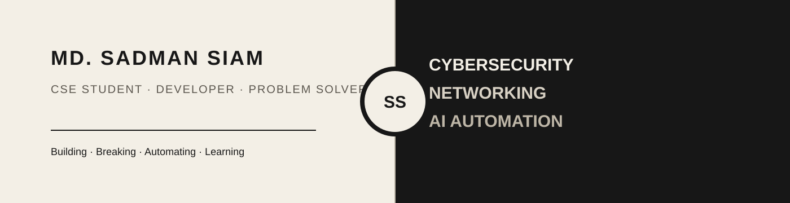

<p align="center">
  
</p>

<h1 align="center">Hi, I'm Md. Sadman Siam 👋</h1>

<p align="center">
  <strong>CSE Student · Cybersecurity · Networking · AI Automation</strong>
</p>

<p align="center">
  Building practical systems, learning how technology works underneath the surface, and turning ideas into working projects.
</p>

<p align="center">
  <a href="https://protfolio-sadman-siam.vercel.app">
    
  </a>
  <a href="https://www.linkedin.com/in/md-sadman-siam-3b41a136a/">
    
  </a>
  <a href="mailto:sadmansiam1110@gmail.com">
    
  </a>
</p>

---

## About Me

I'm a Computer Science & Engineering student at **Daffodil International University**, currently building my skills across **cybersecurity, networking, AI automation, programming, and software development**.

I enjoy practical problem-solving: understanding how systems work, automating repetitive workflows, experimenting with security concepts, and building projects that turn learning into something useful.

- 🔐 Learning **Cybersecurity, Web Security & Bug Bounty**
- 🌐 Working through **Cisco Networking**
- 🤖 Building with **n8n, AI Automation & AI Agents**
- 🐍 Improving **Python**
- ☕ Learning **Java & OOP**
- 🧠 Interested in software, security, automation, and product building

---

## Current Focus

```text
Cybersecurity      ███████░░░  Learning
Networking         ███████░░░  Learning
AI Automation      ████████░░  Building
Python             ██████░░░░  Improving
Java               █████░░░░░  Learning
```

> These bars represent my current learning focus — not proficiency scores.

---

## Tech Stack

### Programming

<p>
  
</p>

### Tools & Platforms

<p>
  
</p>

### Currently Exploring

`Cisco Networking` · `Bug Bounty` · `Web Security` · `n8n` · `AI Agents` · `Python Automation`

---

## Featured Achievement

### 🏆 1st Runner Up — Capture The Flag (CTF)

**Cyber Security Awareness Day 2026**  
Cyber Security Center, Daffodil International University

Solved cybersecurity and exploitation-oriented challenges under strict time constraints and secured **1st Runner Up**.

---

## Featured Projects

### 🤖 AI Lead Management & Qualification Automation

An automated lead-management workflow that:

- captures customer inquiries
- stores lead information in Google Sheets
- sends personalized thank-you emails
- notifies the owner
- classifies leads as **Hot / Warm / Cold**

**Stack:** `n8n` · `Google Forms` · `Google Sheets` · `Gmail` · `AI Automation`

---

### 🧠 LCS & LIS Algorithm Project

Implemented **Longest Common Subsequence** and **Longest Increasing Subsequence** using dynamic programming, including table generation, analysis, and result reporting.

**Stack:** `C` · `Dynamic Programming` · `Algorithms`

---

### 🌐 Personal Portfolio

A custom Hugo portfolio focused on my work in cybersecurity, networking, AI automation, programming, achievements, certifications, and ongoing learning.

**Stack:** `Hugo` · `HTML` · `CSS` · `JavaScript` · `Vercel`

🔗 **Live:** [protfolio-sadman-siam.vercel.app](https://protfolio-sadman-siam.vercel.app)

---

## Certifications

- **AI 100: Fundamentals** — TCM Security
- **Practical Security Fundamentals** — TCM Security
- **Linux 100: Fundamentals** — TCM Security
- **Programming 100: Fundamentals** — TCM Security
- **AgentX Prompting** — Microsoft / Netcom Learning
- **CS50x: Introduction to Computer Science** — Harvard University / edX
- **The Complete Web Development Bootcamp** — Angela Yu / Udemy
- **DIU_CYBERCON 2025** — Organizer

---

## GitHub Activity

<p align="center">
  
  
</p>

---

## What I'm Building Toward

I want to grow from a strong technical foundation into building **secure, useful, automated software products** — while documenting the journey through projects, research, and real-world experimentation.

---

## Connect With Me

<p align="center">
  <a href="https://www.linkedin.com/in/md-sadman-siam-3b41a136a/">LinkedIn</a>
  ·
  <a href="https://protfolio-sadman-siam.vercel.app">Portfolio</a>
  ·
  <a href="https://github.com/midnightfireflies">GitHub</a>
  ·
  <a href="mailto:sadmansiam1110@gmail.com">Email</a>
</p>

<p align="center">
  <i>Always learning. Always building.</i>
</p>
